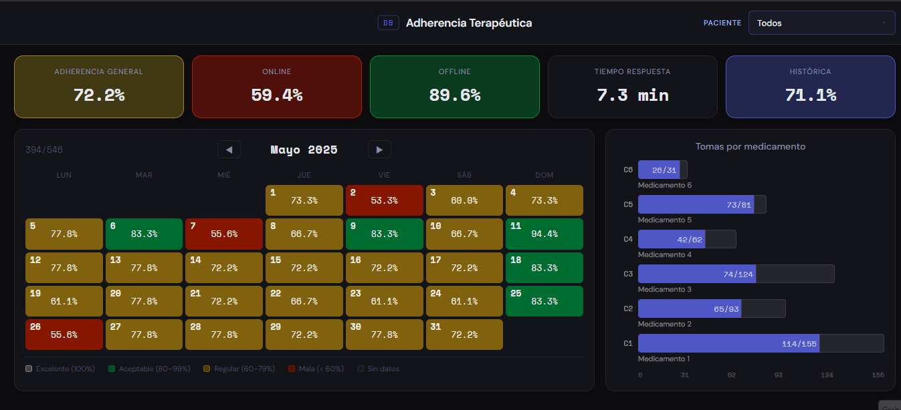

# Adherencia Terapéutica



Sistema de análisis de adherencia terapéutica construido sobre datos reales de un pastillero IoT.

---

## Contexto

Mi proyecto de tesis de la universidad consistio en el desarroollo y construccion de un pastillero IOT, y pense en desarrollo de un sistema de análisis de datos para analizar la adherencia de pacientes a medicamentos para demostrar el como el analisis de datos puede ser utilizado en un proyecto real. Es un pastillero físico con 6 casillas controlado por un ESP32. El hardware registra cada evento de toma — si el paciente confirmó, a qué hora, y si estaba conectado o en modo offline.

El pipeline completo de integración está diseñado así:

```
ESP32 → Blynk → Webhook → Flask (servidor) → PostgreSQL
```

El hardware y la arquitectura de integración existen. **La conexión end-to-end entre el ESP32 y PostgreSQL es la siguiente iteración del proyecto** — el trabajo actual se enfocó en resolver la capa de datos correctamente antes de conectar el hardware.

---

## Qué hace el sistema

```
[ESP32 → Blynk → Webhook → Flask]   →   PostgreSQL (3FN)   →   Python pipeline   →   Flask dashboard
        (arquitectura diseñada,               (implementado)         (implementado)       (implementado)
         integración pendiente)
```

**El dashboard permite:**
- Ver la adherencia mes a mes con navegación por calendario
- Hacer clic en cualquier día y ver el detalle hora por hora
- Comparar adherencia online vs offline por paciente
- Ver qué medicamento (casilla) tiene más omisiones
- Calcular tiempo promedio de respuesta a la alarma

---

## Arquitectura del modelo de datos

El modelo tiene 5 entidades en tercera forma normal:

```
usuario ──< tratamiento >── medicamento
               │
            casilla
               │
       evento_adherencia
```

**Decisión de diseño central:** la casilla física no es el tratamiento. El tratamiento es la entidad que une usuario + medicamento + casilla + configuración clínica. Esto permite histórico limpio, reutilización de casillas y análisis temporal real.

**Restricción crítica a nivel BD:**
```sql
CREATE UNIQUE INDEX ux_casilla_activa
ON ingenieria.tratamiento(id_casilla)
WHERE estado_tratamiento = 'activo';
```

Una casilla solo puede tener un tratamiento activo. La restricción vive en la base de datos, no en la aplicación.

---

## Dataset

Los datos provienen de usuarios de prueba del sistema real. Para proteger su privacidad se aplicaron dos medidas:

- **Pseudónimos** en lugar de nombres reales
- **Censura de medicamentos** — los nombres reales no se registran; el sistema usa etiquetas genéricas (`Medicamento 1`, `Medicamento 2`...) que corresponden a etiquetas físicas escritas por el propio usuario en el pastillero

3 perfiles con patrones de adherencia diferenciados:

| Usuario (pseudónimo) | Adherencia general | Online | Offline | Patrón observado |
|---|---|---|---|---|
| Rogelio | 48.8% | 27.6% | 99.5% | Disciplinado en casa, olvida el pastillero al salir |
| Ana | 81.9% | 90.0% | 73.6% | Alta adherencia online, variable en casa |
| Pedro | 88.3% | 85.0% | 90.7% | Adherencia estable, respuesta lenta |

**1,769 eventos** cubriendo: casillas reutilizadas, tratamientos temporales finalizados, 3 frecuencias de toma distintas, modo online y offline.

> Los datos provienen de usuarios de prueba del sistema real con pseudónimos y medicamentos censurados para proteger su privacidad.

---

## Stack

| Capa | Tecnología |
|---|---|
| Base de datos | PostgreSQL — schema `ingenieria`, restricciones a nivel BD |
| ORM / conexión | SQLAlchemy 2.0 + psycopg2 |
| Pipeline analítico | Pandas — queries parametrizadas, caché 5 min |
| Backend | Flask — API REST con 2 endpoints |
| Frontend | HTML / CSS / JS nativo — sin frameworks |
| Visualización | Plotly.js (KPIs + calendario), HTML/CSS (gráfica medicamentos) |

---

## Estructura del proyecto

```
adherencia_terapeutica/
├── dashboard/
│   ├── app.py                   # Flask + rutas API
│   ├── config/
│   │   └── database.py          # SQLAlchemy engine
│   ├── data/
│   │   └── queries.py           # SQL parametrizados
│   ├── services/
│   │   └── pipeline.py          # Caché + orquestación
│   ├── templates/
│   │   └── index.html           # Jinja2
│   └── static/
│       ├── css/style.css        # Obsidian Medical theme
│       └── js/app.js            # Estado + fetch + render
├── sql/
│   └── ddl_adherencia.sql       # Modelo relacional completo
└── docs/
    └── img/
        └── dashboard_demo.gif
```

---

## KPIs calculados

- **Adherencia General** — `COUNT(tomado) / COUNT(*) * 100` por usuario y mes
- **Adherencia Online** — mismo cálculo filtrado por `modo_operativo = 'online'`
- **Adherencia Offline** — filtrado por `modo_operativo = 'offline'`
- **Tiempo promedio de respuesta** — `AVG(confirmacion - programada)` en minutos, solo eventos tomados
- **Tomas por casilla** — tomadas vs programadas por medicamento y mes

---

## Cómo ejecutar

```bash
# Instalar dependencias
pip install -r requirements.txt

# Crear archivo .env con tus credenciales (ver .env.example)
DB_HOST=localhost
DB_PORT=5432
DB_NAME=db_adherencia_terapeutica
DB_USER=...
DB_PASSWORD=...

# Ejecutar
python dashboard/app.py
```

El dashboard queda en `http://localhost:5000`.

---

## Decisiones que no fueron obvias

**Por qué Flask y no Dash:** Dash usa react-select para el dropdown con clases CSS dinámicas que no se pueden sobrescribir desde hojas de estilos externas. Flask + HTML nativo da control total sobre cada elemento visual.

**Por qué la gráfica de medicamentos es HTML/CSS y no Plotly:** Plotly ignoraba el `range` definido en el layout de forma inconsistente. Un `div` con `width: X%` relativo al máximo real del dataset es más predecible.

**Por qué el histórico es inmutable:** nunca se elimina un tratamiento. Se cambia `estado_tratamiento = 'finalizado'` y se libera la casilla. Esto permite análisis temporal sin perder contexto histórico.

---

## Siguientes pasos

- Conexión end-to-end ESP32 → PostgreSQL
- Empaquetado como `.exe` con PyInstaller
- Módulo de predicción de abandono terapéutico con scikit-learn
